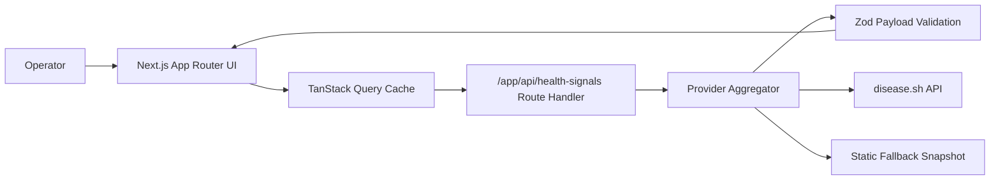

# Health Signal Dashboard

Health Signal Dashboard is a production-grade global health telemetry cockpit focused on trust, freshness visibility, and degraded-mode resilience.

## Highlights
- Operator-first signal cards and regional comparison workflow.
- Source status and freshness budget surfaced in UI.
- Strict runtime validation prevents malformed payload leaks.
- Fallback snapshot keeps core experience stable during provider failures.

## Architecture


## Deployment Model
- Platform: Vercel (production)
- Branch strategy: `master` auto-promotes to production
- Previews: feature branch and PR previews when Git integration is active

## Tech Stack
- Next.js 16 App Router
- React 19 + TypeScript strict mode
- TanStack Query v5
- Zod v4
- Tailwind CSS v4
- Vitest + Playwright

## Local Development
```bash
pnpm install
pnpm dev
```

## Quality Gates
```bash
pnpm run check
pnpm run test:e2e
pnpm run audit:high
pnpm run docs:check
```

## Environment
Copy `.env.example` to `.env.local`.

- `HEALTH_PRIMARY_BASE_URL` provider base override.
- `HEALTH_ALL_PATH` global summary endpoint override.
- `HEALTH_COUNTRIES_PATH` country endpoint override.

## Troubleshooting
- If provider data fails, verify endpoint envs and health in logs.
- If docs CI fails, run `pnpm run docs:check` and repair markdown/mermaid.
- If regional table appears empty, clear filter input and refetch.
