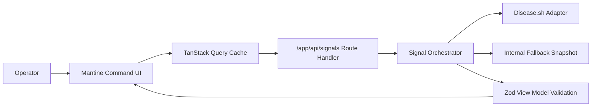

# Global Health Signal Dashboard

Global Health Signal Dashboard is an operations-grade command center for rapid health telemetry scanning across regions and providers.

## Product Value
- Fast top-level signal scan with confidence and freshness metadata.
- Region drill-down pages for decision support.
- Source diagnostics for provider reliability and fallback transparency.
- Fallback-safe operation under upstream provider instability.

## Experience Map
- `/` command center overview
- `/regions/[code]` region command brief
- `/trends` timeline drift workspace
- `/sources` provider diagnostics and contract state

## Architecture


## Deployment Model
- Platform: Vercel
- Production branch: `master`
- PR branches: preview deployments when Git integration is active

## Security Posture
- Server-side provider endpoint control via environment variables.
- No client-exposed secrets.
- CSP and hardening headers configured in [`next.config.ts`](/Users/aib/Desktop/Development/Projects/_rewrites/covid-app/next.config.ts).

## Environment
Copy `.env.example` to `.env.local`.

- `HEALTH_PRIMARY_BASE_URL`: optional override for provider base URL.

## Local Development
```bash
pnpm install
pnpm dev
```

## Quality Gates
```bash
pnpm run check
pnpm run test:e2e
pnpm run audit:high
pnpm run docs:check
```

## Troubleshooting
- If live provider fetch fails, fallback mode should activate automatically.
- If region route returns 404, verify the region code exists in the latest payload.
- If docs checks fail, run `pnpm run docs:check` and fix markdown or Mermaid issues.
