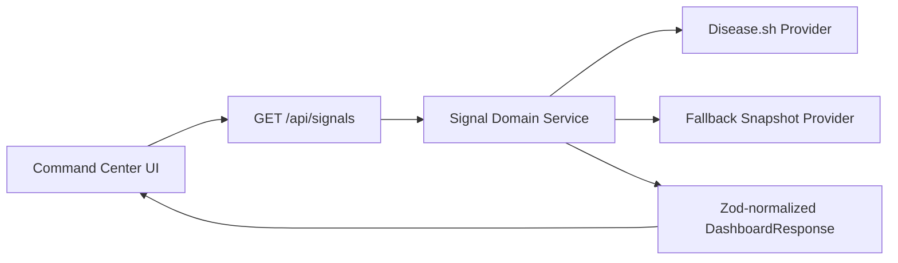

# Health Signal Dashboard Architecture v3

## Runtime Boundaries
- Next.js App Router + TypeScript strict mode.
- Mantine UI for presentation and interaction layout.
- TanStack Query for client-cache orchestration.
- Route handler contracts validated with Zod.

## Topology

## Core Contracts
- `DashboardResponse`
  - `source`, `fallbackUsed`, `freshnessHours`, `partialData`, `generatedAt`
  - `globalMetrics[]`
  - `regionSeries[]`
  - `trendSeries[]`
  - `providerHealth[]`

## Error and Failure Semantics
- `unavailable`: provider request fails, fallback response returned.
- `invalid_payload`: provider payload rejected by schema parser.
- `partial`: metrics present with limited provider coverage.
- `stale`: freshness budget exceeded.
- `rate_limited`: provider throttling encountered.

## Security Notes
- Provider base URL is server-managed and never treated as a secret in the client.
- CSP and secure response headers enforced globally.
